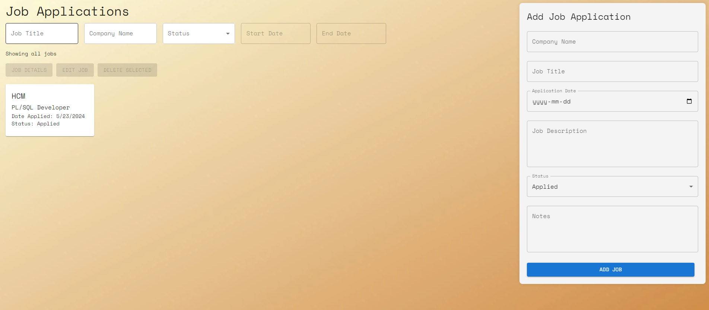

# Job Tracker Application

A job tracking application built with React, Material-UI, and Node.js, allowing users to track job applications, filter, and manage their job search effectively.

## Table of Contents

- [Features](#features)
- [Prerequisites](#prerequisites)
- [Installation](#installation)
- [Running the Application](#running-the-application)
- [Usage](#usage)
- [API Endpoints](#api-endpoints)
- [Screenshots](#screenshots)
- [Contributing](#contributing)

## Features

- Add, edit, and delete job applications
- Filter job applications by title, company name, status, and date range
- View job details in a modal popup
- Responsive design with Material-UI
- Uses MongoDB for data storage

## Prerequisites

- [Node.js](https://nodejs.org/) (version 14 or higher)
- [Docker](https://www.docker.com/)
- [MongoDB](https://www.mongodb.com/) (can be run via Docker)

## Installation

1. **Clone the repository:**

   ```bash
   git clone https://github.com/your-username/job-tracker.git
   cd job-tracker
   ```

2. **Install frontend dependencies:**

   ```bash
   npm install
   ```

3. **Install backend dependencies:**

   ```bash
   cd job-tracker-backend
   npm install
   cd ..
   ```

## Running the Application

### Running MongoDB with Docker

1. **Create a `docker-compose.yml` file in the root directory:**

   ```yaml
   version: "3.1"

   services:
     mongo:
       image: mongo
       restart: always
       ports:
         - 27017:27017
       volumes:
         - mongo-data:/data/db

   volumes:
     mongo-data:
   ```

2. **Start MongoDB:**

   ```bash
   docker-compose up -d
   ```

### Running the Backend

1. **Navigate to the backend directory and start the server:**

   ```bash
   cd job-tracker-backend
   npm start
   cd ..
   ```

### Running the Frontend

1. **Start the development server:**

   ```bash
   npm run dev
   ```

## Usage

- **Add a Job Application:** Fill in the job details and click "Add Job".
- **Edit a Job Application:** Select a job and click "Edit Job", make changes, and save.
- **Delete Job Applications:** Select one or multiple jobs and click "Delete Selected".
- **View Job Details:** Select a job and click "Job Details" to view more information.
- **Filter Jobs:** Use the filter fields to narrow down job applications by title, company name, status, and date range.

## API Endpoints

### Backend API

- **GET /jobs**: Retrieve all job applications
- **POST /jobs**: Create a new job application
- **PUT /jobs/:id**: Update an existing job application
- **DELETE /jobs/:id**: Delete a job application

## Screenshots



## Contributing

1. Fork the repository
2. Create your feature branch (`git checkout -b feature/fooBar`)
3. Commit your changes (`git commit -am 'Add some fooBar'`)
4. Push to the branch (`git push origin feature/fooBar`)
5. Create a new Pull Request
